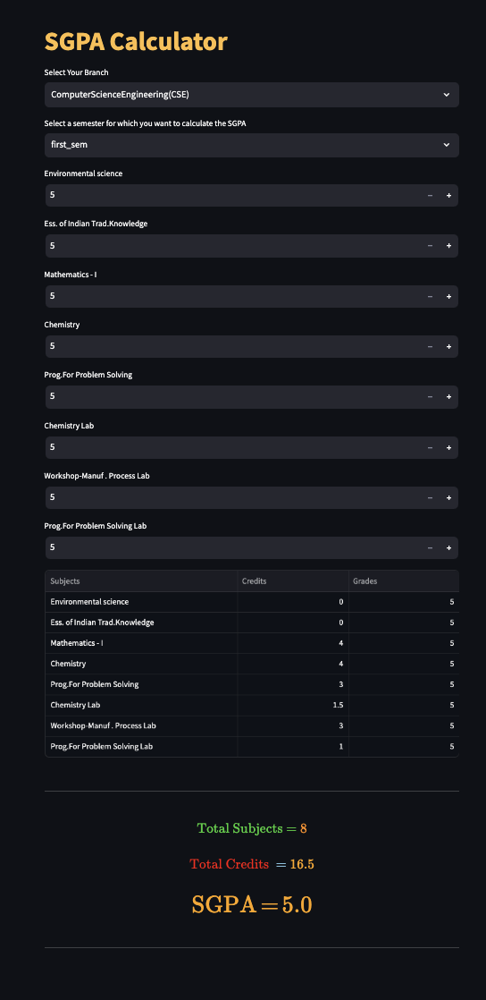
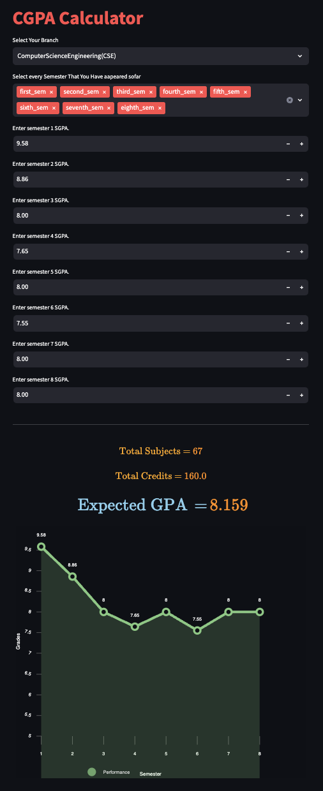

# Osmania University Result Analyser:
## Setup:
1. clone the git repository:
    ```
    git clone https://github.com/Mohammed-Khubaib/Osmania-University-GPA-Analyser.git
    ```
2. install the dependencies
    ```
    pip install -r requirements.txt
    ```
3. run the application:
    ```
    streamlit run app.py
    ```
## User interface:
* SGPA Calculator:

    
* CGPA Calculator:
    

## Code Structure:
```
.
├── LineChart.py
├── Readme.md
├── app.py
└── engineering_curriculum.yaml
```
